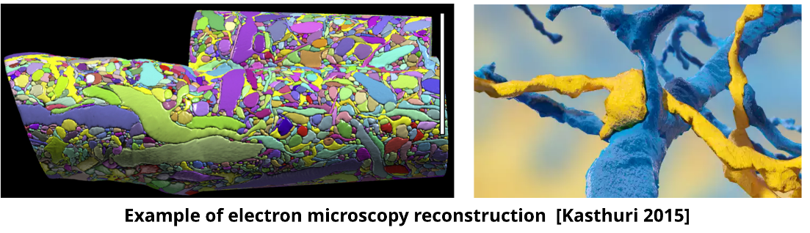

# WELCOME TO THE KASTHURI CHALLLENGE!


## Links
* [Bossdb Page](https://bossdb.org/project/kasthuri2015)
* [Challenge Website]

## Background
 In the past decade, there have been major pursuits in understanding large scale neuroanatomical structures in the brain. With such ventures, there has been a surplus amount of brain data that can potentially reveal different phenomenons about brain organization. Currently, many machine and deep learning tools are being pursued, however there is still a need for new standards for understanding these large scale brain datasets. To access this challenge, we introduce a new dataset, annotations, and tasks that provide a diverse approach to readout information about brain structure and architecture. We adapted a previous multitask neuroimaging benchmark (MTNeuro) of a volumetric, micrometer-resolution X-ray microtomography image spanning a large thalamocortical section of a mouse brain as a baseline for our challenge. Our new standardized challenge (Kasthuri Challenge) aims to generate annotations of a saturated reconstruction of a sub-volume of mouse neocortex imaged with a scanning electron microscope. Specifically, annotations of synapses and membranes are the regions of interest as they provide the best results and insights of how machine and deep learning are able pinpoint the unique connectivity at the microstructure level. Datasets, code, and pre-trained baseline models are provided at: TBD
 
* Info on paper found below

## Meet Team Benchmark (BRK)!
Team BRK's mission is to improve tools for processing large amounts of brain datasets coming from a wide array of sources and to make brain data more accessible to the neuroscience community! To help achieve this mission, Team BRK uses data standardization for machine learning in order to effectively process these new emerging datasets.

Inspired by the MTNeuro Benchmark Dataset found [here](https://github.com/MTNeuro/MTNeuro), the Kasthuri Challenge introduces new annotations of synapses and membranes of neural tissue from a mouse cortex. [BossBD](https://bossdb.org/), an open source volumetric database for 3D and 4D neuroscience data and Neuroglancer were used to derive annotations from the dataset.  

## Getting Started
### Installation
To get started, clone this repository, change into the directory and run 
```
pip install -e ./
```
The code has been tested with
* Python >= 3.8
* PIP == 22.1.2
* torch == 1.11.0
* torchvision == 0.12.0
* numpy == 1.19.3

To get started running examples, files in the scripts directory can be run following this example
```
python3 scripts/task_membrane.py
```
or
```
python3 scripts/task_synapse.py
```
and will load default configuration scripts and public authetication credentials. The training script will output trained network weights as a 'pt' file, and produce output figures. 

## Citation
If you find this project useful in your research, please cite the following paper!

* Kasthuri N, Hayworth KJ, Berger DR, Schalek RL, Conchello JA, Knowles-Barley S, Lee D, Vázquez-Reina A, Kaynig V, Jones TR, Roberts M, Morgan JL, Tapia JC, Seung HS, Roncal WG, Vogelstein JT, Burns R, Sussman DL, Priebe CE, Pfister H, Lichtman JW. Saturated Reconstruction of a Volume of Neocortex. Cell. 2015 Jul 30;162(3):648-61. doi: 10.1016/j.cell.2015.06.054. PMID: 26232230.
